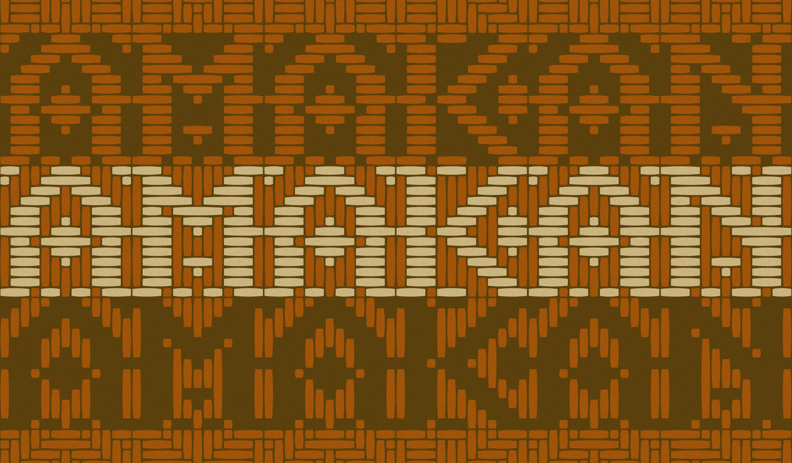
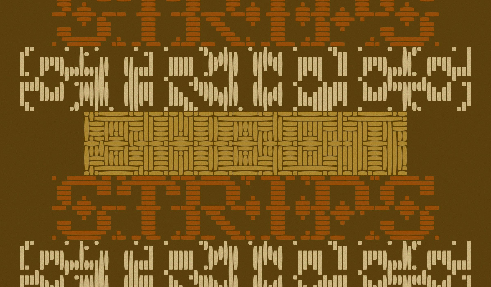
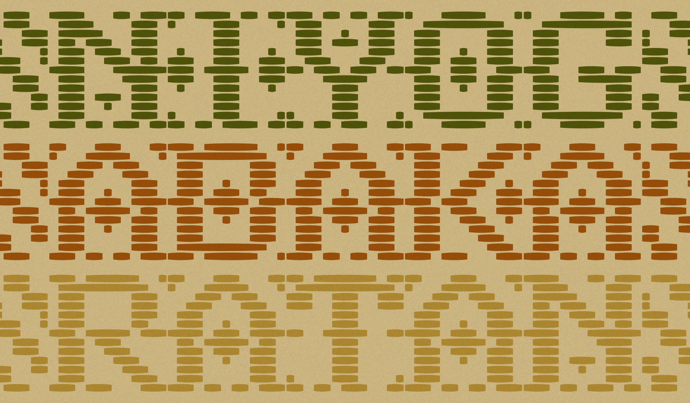
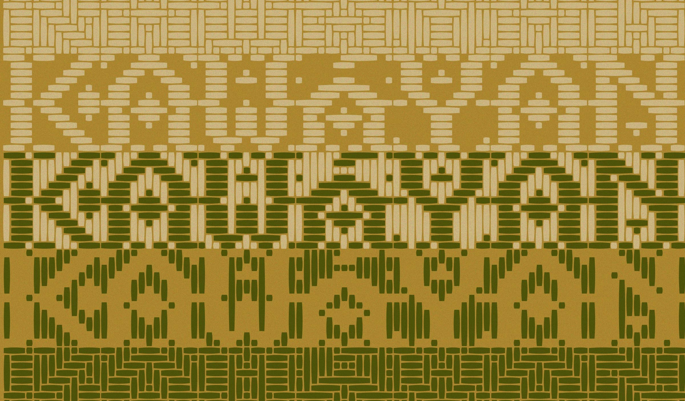
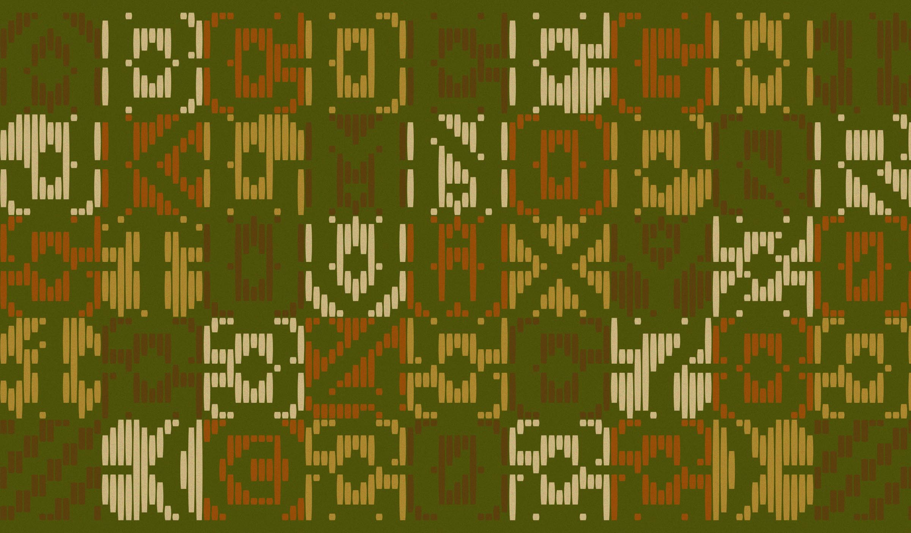
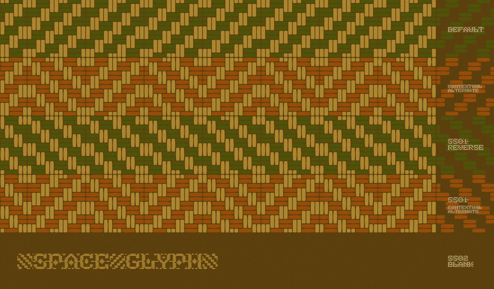
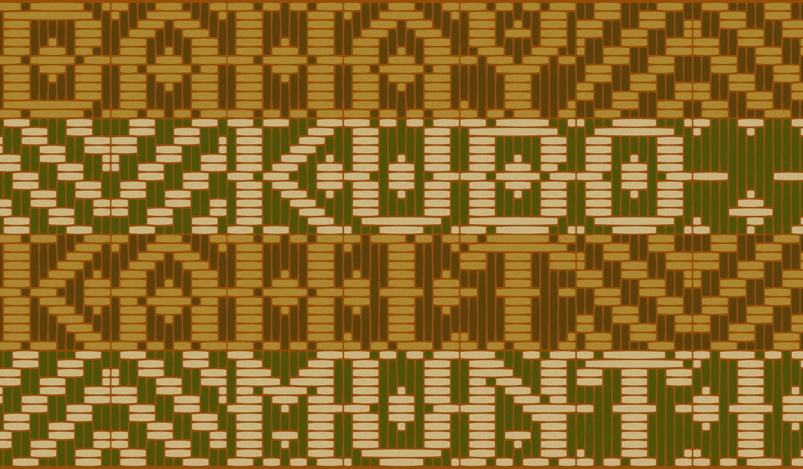

# Amakan

A nod to local materials and craftsmanship, Amakan is a typeface patterned after the woven split-bamboo mats used as wall cladding for traditional nipà huts in the Philippines, translating repeating motifs of diagonal, zigzag, and diamond-like shapes in the weaves into typography.

Made in the Philippines 🇵🇭 by Jad Maza 2022

Constructed inside a square grid producing its monospaced format, it is composed of 3 styles, namely: <strong>Sheet</strong>, occupying the entire area for the glyph; <strong>Strips</strong>, made up of horizontal strands to draw the character; and <strong>Stripes</strong>, filling up the negative space with vertical lines.

Developed as an entry to the 9th edition of the annual 36 Days of Type challenge in 2022, Amakan is now a functional font with 66 glyphs per style, which includes basic Latin, numerals, Filipino diacritics, and some punctuation and symbols. 

The current version has a filled 'space glyph,' with an upward weave direction as the default, a reverse stylistic set 1, and a blank space stylistic set 2. When the contextual alternates function is activated, the weave direction cycles between the default and ss01.

## License

Amakan is licensed under the SIL Open Font License, Version 1.1. This license is copied below, and is also available with a FAQ at http://scripts.sil.org/OFL

## Repository Layout

This font repository structure is inspired by Unified Font Repository v0.3.
